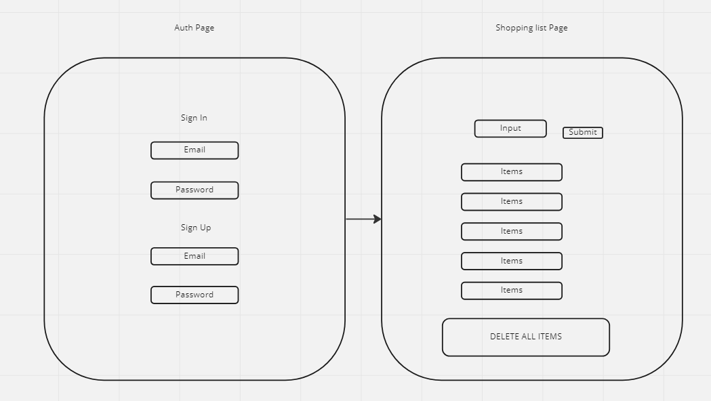

## Data Model

    -id
    -timestamp
    -item
    -quantity
    -is_bought
    -user_id

## Shopping List Page

    -On submit, user should be able to add item and add quantity
        -get form data in sumbit event listener
        -use form data to make new list item in supabase
    -On page load fetch, render, append items but only that users items
        -fetch items
        -add them to state empty array
        -clear dom
        -display items (function)
    -On submit user should be able to see their own list items
        -fetch users unique items
        -put in state array
        -clear dom
        -display items
    -List items should be clickable to indicate item has been bought
        -on click update supabase by id
        -fetch users items
        -put them in state
        -clear dom
        -display items
        -when clicked add class of bought or complete to indicate visually to user that item has been bought or found
    -If user is logged in display their username/email in
